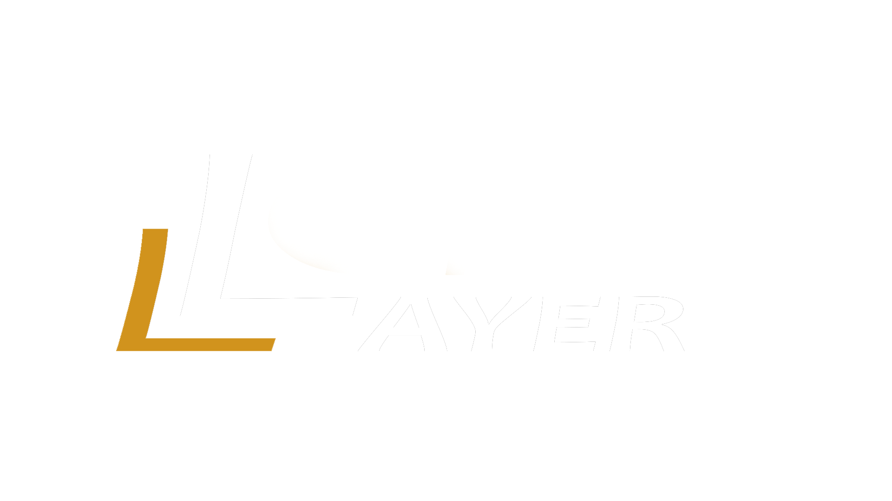

**crafted by Fatih Yenen**

> "Craft the Layers of Reality"

Thank you for your support! Let us re-invent modular material systems together.

For problems or suggestions: **fathyenn123@gmail.com**

---

## About LayerCraft

LayerCraft is a modular layered material system for Unreal Engine 5, designed to give artists full control over surface complexity without sacrificing performance.

**MasterCraft** is the complete framework containing LayerCraft & LandCraft.

Built around UE5's native Material Layer framework, LayerCraft requires no plugins, no external dependencies, and no engine modifications. It is a pure asset package — drop it into any project and it works immediately, regardless of project type or scale.

Stack, blend, and customize material layers non-destructively — from simple terrain surfaces to complex multi-layer landscapes with procedural masking, edge wear, and runtime virtual texture support. Lightweight by design, LayerCraft integrates cleanly into existing pipelines without disrupting your current setup.

Whether you are building open-world environments, architectural visualizations, or cinematic scenes, LayerCraft provides a consistent, scalable workflow that grows with your project.
