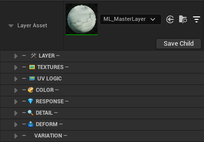

# ML\_MasterLayer

**Layer Asset Reference**

`ML_MasterLayer` defines how a single surface looks and behaves. Every visual property — textures, UV logic, color, physical response, detail normals, deformation, and surface variation — is controlled through the parameter groups below.

---

**🎭 Layer** ↓ 
**🗺️ UV Logic** ↓ 
**🖼️ Textures** ↓ 
**🎨 Color** ↓ 
**💎 Response** ↓ 
**🔍 Detail** ↓ 
**🏔️ Deform** ↓ 
**🎲 Variation**

