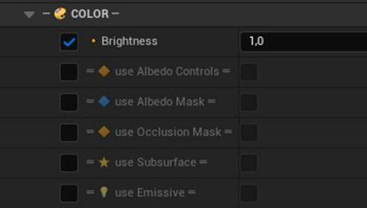
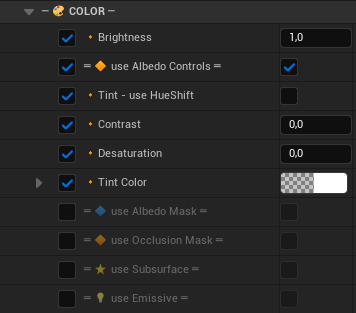
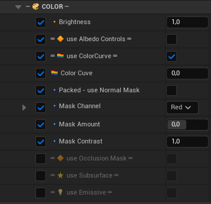
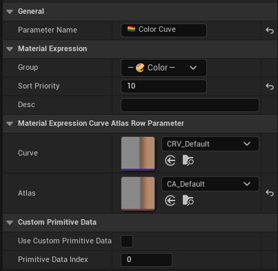
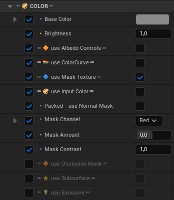
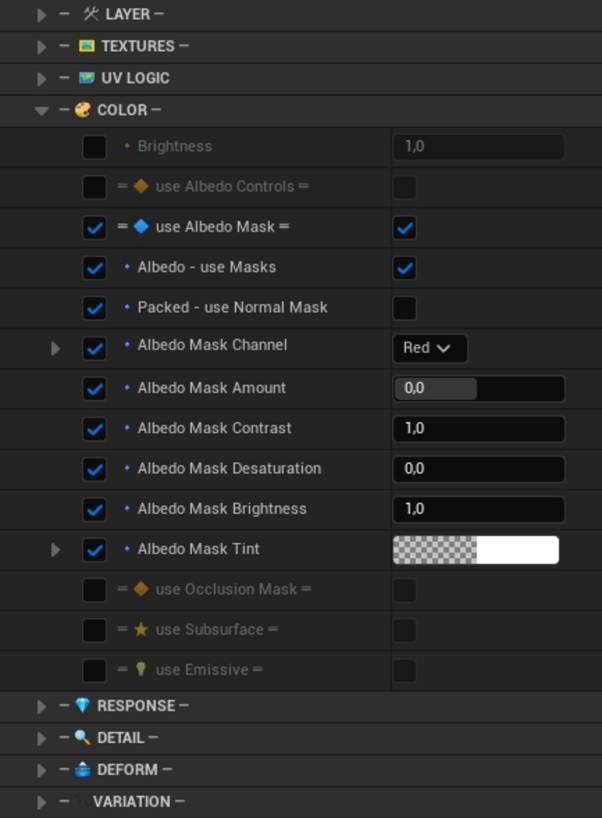
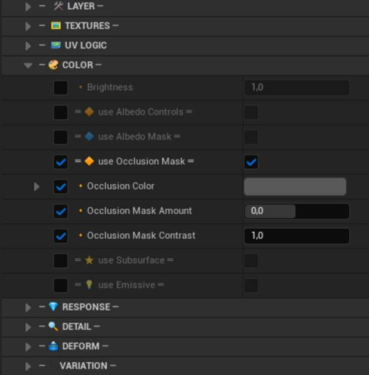
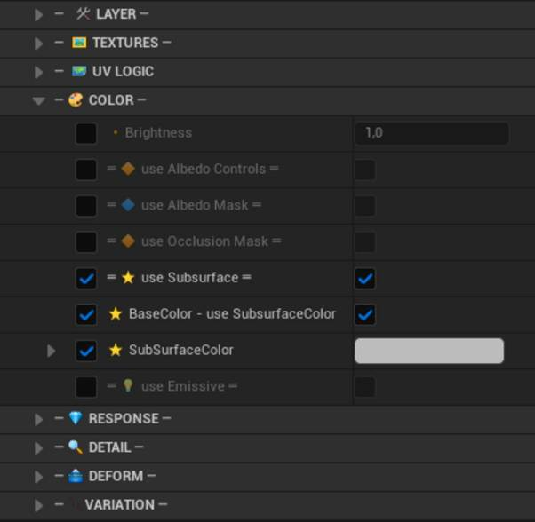
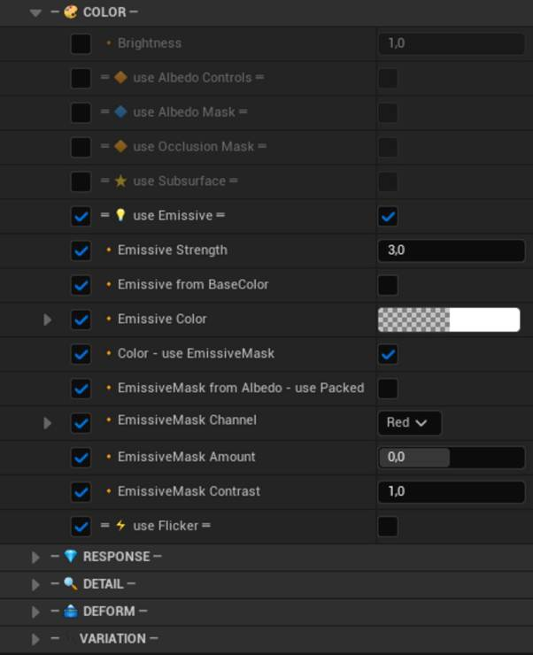
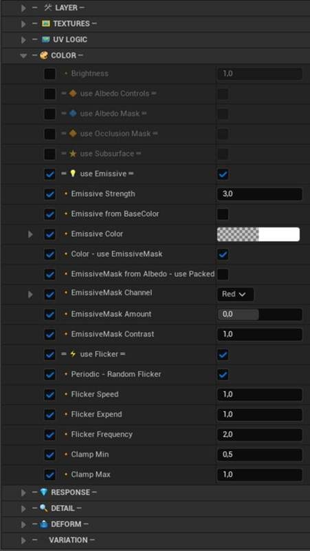

# 🎨 Color

Controls albedo brightness, tinting, correction, masking, subsurface scattering, and emissive output.

---

| Parameter | Description |
|-----------|-------------|
| **Brightness** | Global luminance multiplier for the layer. `1.0` is neutral. |

---

### ♦ use Albedo Controls

Reveals fine-grained color correction tools — tinting, contrast, desaturation, and hue rotation.

| Parameter | Description |
|-----------|-------------|
| **Tint - use HueShift** | Switches Tint Color from direct multiply to hue rotation mode. |
| **Contrast** | Increases or decreases the separation between darks and lights in the albedo. |
| **Desaturation** | Pushes the albedo toward grayscale. `0.0` = full color, `1.0` = fully desaturated. |
| **HueShift** | Rotates the hue across the color wheel. Only active when `Tint - use HueShift` is enabled. |
| **Tint Color** | Multiplicative tint applied to the base albedo. |

#### use ColorCurve

Enables a curve-based remapping of the albedo output. Only when Albedo Texture is disabled.

| Parameter | Description |
|-----------|-------------|
| **Color Curve** | The parameter input — there is a default curve asset in the content. |

#### use Mask Texture

When Albedo Texture is disabled, additional mask textures can be used as color mask.

| Parameter | Description |
|-----------|-------------|
| **Packed - use Normal Mask** | Reads the albedo mask from a packed channel of the normal map — saves a texture sample. |
| **Mask Channel** | Selects which channel of the mask texture to sample. |
| **Mask Amount** | Offsets the general mask threshold. |
| **Mask Contrast** | Sharpens or softens the general mask edge. |

---

### ♦ use Albedo Mask

A masking layer for base color — enabling per-region desaturation, brightness correction, and tinting.

| Parameter | Description |
|-----------|-------------|
| **Albedo - use Masks** | Selects either Albedo Texture or Masked Textures to generate Albedo Mask. |
| **Albedo Mask Channel** | Selects the texture channel (R/G/B/A) used as the albedo mask. |
| **Albedo Mask Amount** | Threshold offset for the albedo mask. |

| **Albedo Mask Contrast** | Controls the edge sharpness of the albedo masked region. |
| **Albedo Mask Desaturation** | Desaturates the albedo within the masked area. |
| **Albedo Mask Brightness** | Scales brightness independently within the albedo masked region. |
| **Albedo Mask Tint** | Multiplies a color tint over the masked region. |

---

### ♦ use Occlusion Mask

Applies a localized darkening pass via texture mask — simulates ambient occlusion without baking new maps.

| Parameter | Description |
|-----------|-------------|
| **Occlusion Color** | The shadow color applied to occluded regions. |
| **Occlusion Mask Amount** | Offsets the occlusion mask threshold. |
| **Occlusion Mask Contrast** | Controls the hardness of the occlusion boundary. |

---

### ♦ use Subsurface

Activates subsurface scattering — light penetrates and diffuses beneath the surface.

| Parameter | Description |
|-----------|-------------|
| **BaseColor - use SubsurfaceColor** | Derives the subsurface color directly from Base Color. |
| **SubSurfaceColor** | The color of light scattering beneath the surface interior. |
| **SubSurfaceDarken** | Controls how much the surface darkens where backlit subsurface is strongest. |

---

### ♦ use Emissive

Enables emissive output connecting to Unreal's emissive channel, interacting with Lumen and bloom.

| Parameter | Description |
|-----------|-------------|
| **Emissive Strength** | Intensity multiplier for emissive output. `3.0` is a solid starting value for Lumen-lit scenes. |
| **Emissive from BaseColor** | Derives emissive color directly from Base Color. |
| **Emissive Color** | Direct emissive color picker. Active only when `Emissive from BaseColor` is OFF. |

| **Color - use EmissiveMask** | Enables a texture mask to restrict emission to specific surface regions. |
| **EmissiveMask from Albedo - use Packed** | Reads the emissive mask from a packed channel of the albedo texture — saves a texture slot. |
| **EmissiveMask Channel** | Selects which channel (R/G/B/A) carries the emissive mask data. |
| **EmissiveMask Amount** | Threshold offset for the emissive mask. |
| **EmissiveMask Contrast** | Edge sharpness of the emissive mask boundary. |

#### use Flicker

Adds procedural animated flickering to the emissive output — no Blueprint, no timeline.

| Parameter | Description |
|-----------|-------------|
| **Periodic - Random Flicker** | ON = randomized flicker; OFF = rhythmic sine-wave pattern. |
| **Flicker Speed** | Rate of the flicker animation. |
| **Flicker Expend** | Amplitude of each flicker cycle — how dramatically emissive rises and falls. |
| **Flicker Frequency** | Cycles per second in periodic mode. |
| **Clamp Min** | Floor value for emissive during flicker — keeps surface visible at minimum intensity. |
| **Clamp Max** | Ceiling value for emissive during flicker — prevents overexposure at peak. |
